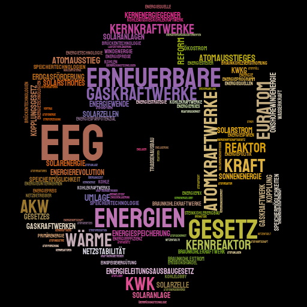

# Politics with NLP

Political opinions expressed exceed the volume a human can digest. That makes measuring changes in opinions with NLP a valid case. Here, I focus on a specific item on the political agenda, the sudden turnaround of energy politics following the external shock of the nuclear disaster in Japan in 2011. The overall goal is the development of a methodology to extract opinions from political speech.



In this repo, I pick up efforts undertaken with NLP for my Master's thesis in 2017/18. Early commits polish the original code around the original data source, based-off [bundestag/plpr-scraper](https://github.com/bundestag/plpr-scraper), an effort that provided parsed plenary protocols covering 363 plenary meetings from 2009 till 2015. Later, as [open-discourse](https://github.com/open-discourse/open-discourse), in 2021, made all plenary meetings since 1949 available in an analysis-friendly format, I refactor the code to use all of the new data. All text processed is in German.

## Get started

Python 3.8 environment set up with conda and pip-tools on MacOS.

```shell
conda create -n bt python=3.8 -y
conda activate bt
pip install pip-tools
pip-compile --output-file=macos-py3.8-requirements.txt macos-py3.8-requirements.in
pip-sync macos-py3.8-requirements.txt
jupyter labextension install jupyterlab-plotly@4.14.3
```

## Notebooks

### Notebook 01 - spaCy Exploration

Overview of linguistic features in speech parsing

- Part-of-speech (POS) tagging
- Syntactic dependencies within sentence parse trees
  - Ancestors & descendants
  - Syntactic relations
- Named-Entity Recognition (NER)
- Sentiment analysis

### Notebook 02 - Plenary Protocols

Data preparation of parsed plenary protocols between 2009-2015, forked from [bundestag/plpr-scraper](https://github.com/bundestag/plpr-scraper).

### Notebook 03 - Topic Modeling

- Text preprocessing with spaCy
  - Tokenization
  - Stemming & lemmatization, punctuation, whitespace
  - Creation of n-grams
- Documents turned into corpus and bag-of-words representations
- Topics uncovered with Latent Dirichlet Allocation
- Visualization of topics with pyLDAvis
- Detection of energy politics within topcis

_View the notebook [here](https://nbviewer.jupyter.org/github/sebas-seck/bundestag_nlp/blob/main/nb_03_topic_modelling.ipynb#topic=0&lambda=1&term=) with Jupyter's nbviewer as the interactive visualizations are not rendered with the static display of notebooks on Github. Alternatively, paste the link to the notebook on Github [here](https://nbviewer.jupyter.org/)._

### Notebook 04 - Stylecloud

Quick detour for a word cloud visual in the shape of an atom, prepared with Stylecloud

### Notebook 05 - Open Discourse Data

Overview of the new data source with all plenary protocols since 1949

### Notebook 06 - Analysis of Politicians' Opinion Change after Fukushima 2011

- Design of an opinion change algorithm applicable to energy politics

### Notebook 07 - Timeline

- Visualization of speeches related to energy politics, view result [here](https://htmlpreview.github.io/?https://github.com/sebas-seck/bundestag_nlp/blob/main/nb_07_energy_politics_timeline.html)
